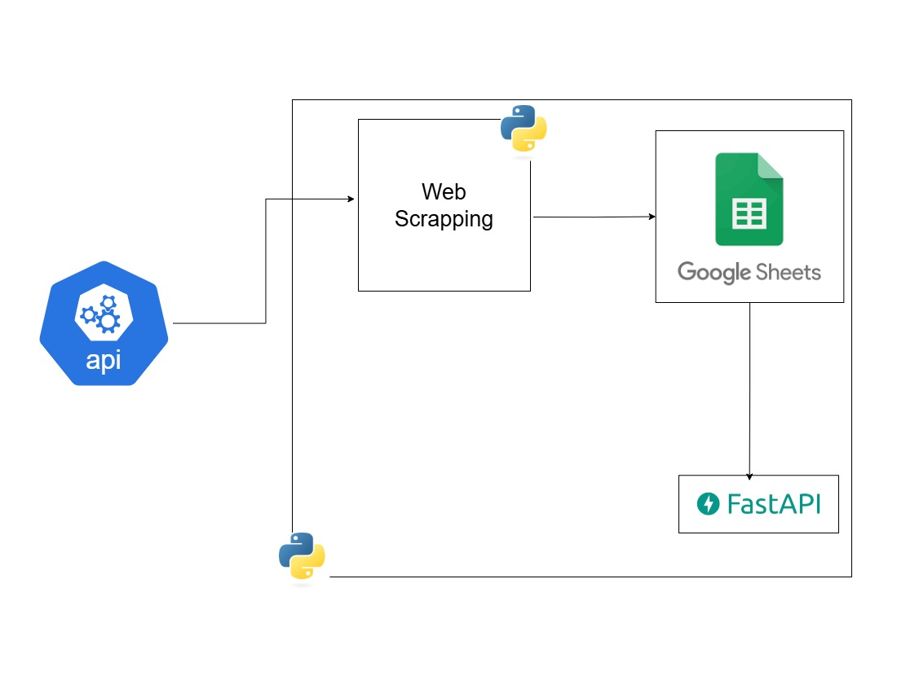
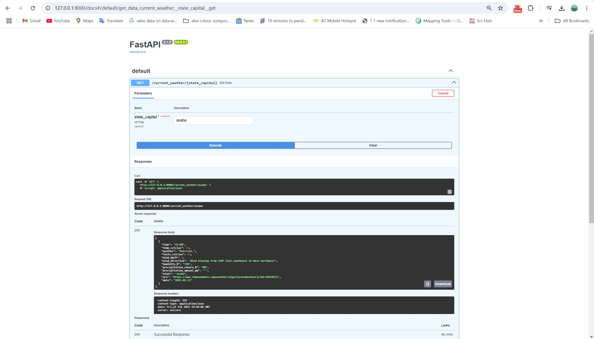

# **Weather Scraper API**

## **Overview**
The **Weather Scraper API** is a FastAPI-based web service that scrapes weather data from [Time and Date](https://www.timeanddate.com/weather/nigeria/), extracts relevant weather details for three selected Nigerian states, cleans the data (using regex), and writes it to a Google Sheet. The API is designed for real-time weather monitoring and can be tested via FastAPI's interactive documentation (/docs).


## **Features**
- **FastAPI Endpoint**: Provides a GET endpoint to fetch weather data, process it, and update Google Sheets.
- **Web Scraping**: Extracts weather information from Time and Date’s website.
- **Data Cleaning**: Uses regex and other techniques to clean scraped data.
- **Google Sheets Integration**: Uses `gspread` to authenticate and update a Google Sheet.
- **Dependency Management**: Uses Poetry for package management.
- **Virtual Environment**: Uses `venv` for environment isolation.
- **API Documentation**: Provides an interactive Swagger UI at `/docs`.


## **Project Structure**
```
weather_api/
    ├── .gitignore
    ├── .env.example
    ├── README.md
    ├── main.py
    ├── config.py
    ├── pyproject.toml
    ├── poetry.lock
    ├── scraper/
    │   ├── __init__.py
    │   ├── scraper.py
    │   └── google_sheet.py
    ├── tests/
    │   ├── __init__.py
    │   └── test_scraper.py
```
## Project Requirements  

### 1. Authentication  
- A JSON key file to activate a Google Service Account  
- The service account should have **Editor** role access to Google Sheets  

### 2. Technology Stack  
- **Python** as the core programming language  
- **Poetry** for package management  
- **FastAPI** for building a web API  
- **BeautifulSoup** for web scraping  
- **Pandas** for data manipulation  
- **gspread** for interacting with Google Sheets  
- **oauth2client** for Google authentication  

### 3. Development Tools  
- **pytest** for testing  
- **black** for code formatting  
- **pylint** for code linting  

### 4. Setup Instructions  
1. **Service Account Authentication**  
   - Generate a JSON key file for a Google Service Account  
   - Assign the **Editor** role to the service account for Google Sheets  
   - Load the credentials in your Python project  

2. **Install Dependencies** using Poetry  
   ```sh
   poetry install
   ```


## **Installation & Setup**
### **1. Clone the Repository**
```bash
git clone https://github.com/Data-Epic/weather_api.git
cd weather_api
```
### **2. Install Poetry**
```bash
pipx install poetry
```
### **3. Install Dependencies**
```bash
poetry install
```
### **4. Activate Virtual Environment**
```bash
poetry shell
```

### **5. Run the API**
```bash
python main.py
```
## **Usage**
### **FastAPI Swagger UI**
Once the API is running, visit:
```
http://127.0.0.1:8000/docs
```
This provides an interactive interface to test the API endpoints.

## **Work Architecture**


### **FastAPI Swagger Documentation**


## **Author**
**Ajeyomi Adedoyin Samuel**
