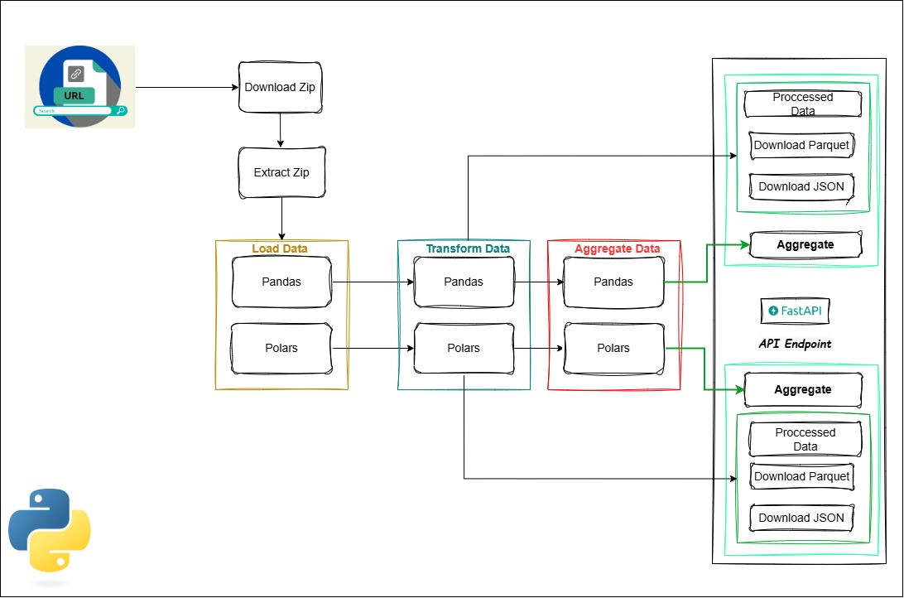
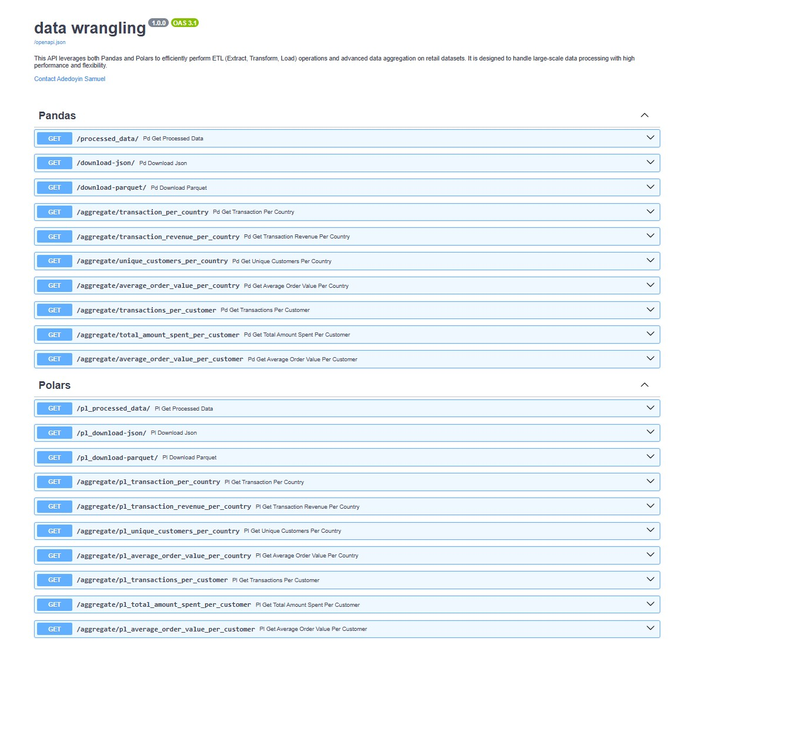

## **Data Processing API**  

## **Overview**  
The goal of this project is for  a data engineer taht works in a retail industry, to take a retail data collecged overtime, explore it, and use his or her expertise as a data engineer to extract, transform and load the data data. The ned goal after the etl process is to build various API endpoints (FASTAPI endpoints) for data processing, aggregation and downloads. These endpoints should allow users to download data in Parquet and JSON formats and perform aggregate functions using **Polars** and **Pandas** for these tasks. To test the tool's efficiency, run an end-to-end process and refer to the architecture to understand the workflow.

### **Data Information**  
The **Online Retail II** dataset contains all transactions for a **UK-based and registered non-store online retail business** between **01/12/2009 and 09/12/2011**. The company primarily sells unique, all-occasion giftware. Many of its customers are wholesalers.  

- **InvoiceNo**: Invoice number (Nominal). A 6-digit integral number uniquely assigned to each transaction. If this code starts with the letter 'C', it indicates a cancellation.  
- **StockCode**: Product (item) code (Nominal). A 5-digit integral number uniquely assigned to each distinct product.  
- **Description**: Product (item) name (Nominal).  
- **Quantity**: The quantity of each product (item) per transaction (Numeric).  
- **InvoiceDate**: Invoice date and time (Numeric). The date and time when a transaction was generated.  
- **UnitPrice**: Unit price (Numeric). Product price per unit in sterling (£).  
- **CustomerID**: Customer number (Nominal). A 5-digit integral number uniquely assigned to each customer.  
- **Country**: Country name (Nominal). The name of the country where a customer resides.  

## **Architecture**  
  

## **Project Features**  
- **FastAPI Endpoints**: Provides RESTful API endpoints for data processing.  
- **Data Processing**: Uses **Polars** and **Pandas** to load, clean, and aggregate datasets.  
- **File Handling**: Saves processed data in JSON and Parquet formats.  
- **Performance Benchmarking**: Compares processing speeds of **Polars** and **Pandas**.  
- **Interactive API Documentation**: Uses Swagger UI (`/docs`) for API testing.  
- **Error Handling**: Ensures robust data validation and processing.  

## **Project Folder Structure**  
```
data_api/
    ├── .gitignore
    ├── .env.example
    ├── README.md
    ├── main.py
    ├── pyproject.toml
    ├── poetry.lock
    ├── api/
    │   ├── api.py
    │   └── model.py
    ├── notebook/
    │   ├── __data
    │   └── notebook.ipynb
    ├── processor/
    │   ├── __init__.py
    │   ├── load_data.py
    │   ├── clean.py
    │   ├── aggregate.py
    │   ├── utils.py
    │   ├── config.py
    └── tests/
        ├── __init__.py
        └── test_processor.py
```  

### 1. Clone the Repository
```bash
git clone https://github.com/Data-Epic/data-wrangling.git
```

### 2. Create and Switch to a New Branch
```bash
git checkout -b adedoyin-samuel-project
```

### 3. Install Dependencies
```bash
poetry install
```

### 4. Activate the Virtual Environment
```bash
poetry shell
```

### 5. Run the Main Script
```bash
poetry run python main.py
```

### 6. Access API Documentation**  
Open your browser and go to:  
```
http://127.0.0.1:8000/docs
```  

### **Data Transformation Steps**  
1. **Removing Negative Price Values**  
   - If a transaction has a negative **Price**, it likely represents a **canceled order, refund, or adjusted bad debt**.  
   - Keeping these values could distort revenue calculations and business insights.  
   - To ensure accurate financial analysis, all rows with negative **Price** will be removed.  

2. **Removing Negative Quantity Values**  
   - A negative **Quantity** suggests an issue, such as **returns, data entry errors, or adjustments**.  
   - Transactions should typically have positive quantities, as negative values are not standard in sales records.  
   - To maintain data integrity, these rows will also be dropped.  

3. **Why Remove These Rows?**  
   - Any transaction where **Price** or **Quantity** is negative indicates **data issues** that could affect analysis.  
   - Removing them ensures that only valid and meaningful sales records remain.  
   - This step helps produce **more reliable** business insights, revenue tracking, and customer behavior analysis.
4. **Missing Customer IDs**: 
    - Some rows have missing **CustomerID** values, which could lead to the loss of important transaction data if removed. Instead of dropping them, I will replace missing values with `"Unknown"` to maintain data integrity.  

## **API Endpoints**  
### **1. Process Data** (`POST /process-data`)  
- Loads, cleans, and aggregates data.  
- Returns JSON results.  

### **2. Download Processed Data**  
- **JSON format**: `GET /download-json`  
- **Parquet format**: `GET /download-parquet`  

### **3. Aggregate Endpoints** 

 Aggregation Functions for Pandas and Polars

#### Pandas Aggregation Functions

- **`pd_transaction_per_country**
 - **`pd_transaction_revenue_per_country**
- **`pd_unique_customers_per_country**
 - **`pd_average_order_value_per_country**
- **`pd_transactions_per_customer**
- **`pd_total_amount_spent_per_customer**
- **`pd_average_order_value_per_customer**

#### Polars Aggregation Functions
- **`pol_transaction_per_country**
- **`pol_transaction_revenue_per_country**
- **`pol_unique_customers_per_country**
- **`pol_average_order_value_per_country**
- **`pol_transactions_per_customer**
- **`pol_total_amount_spent_per_customer**
- **`pol_average_order_value_per_customer**

#### Usage
- The `PandasAggregation` class is designed for operations using the Pandas library.
- The `PolarsAggregation` class is optimized for fast and efficient data operations using the Polars library.
- Both classes expect a valid DataFrame as input and return the respective aggregated results.

## **API Endpoints - FASTAPI Swagger UI**  
  


## **Suggestions**  

As a data engineer, it's crucial to consider the needs of end users, such as data analysts, and the types of calculations they will perform with the data. Upon reviewing the dataset, I noticed that some descriptions were missing. More importantly, certain customer IDs were absent. However, this does not necessarily mean that these transactions did not occur—it could be due to gaps in their system.  

A proper approach would be to implement **data modeling**, ensuring a well-structured database by splitting the data into three key tables:  

- **Products** – Contains product details such as name, category, and price.  
- **Transactions** – Records all sales and links them to customers and products.  
- **Customers** – Stores customer details, ensuring each transaction can be properly attributed.  


### **Considerations**  
I considered keeping transactions with issues since they might help analyze cancellations and adjustments. However, since the requirement is to process only valid data, I will keep only transactions with **positive Price and Quantity**, ensuring clean and reliable data for analysis.  

