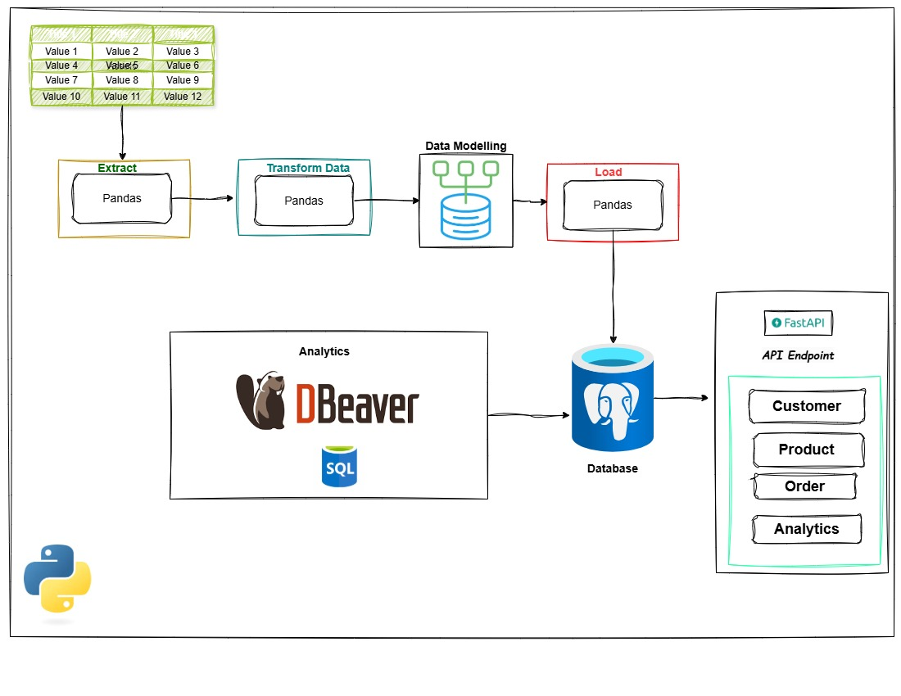
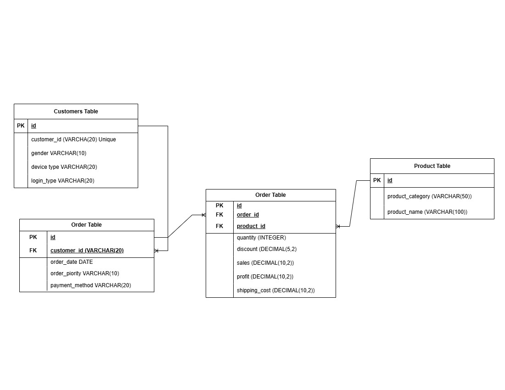
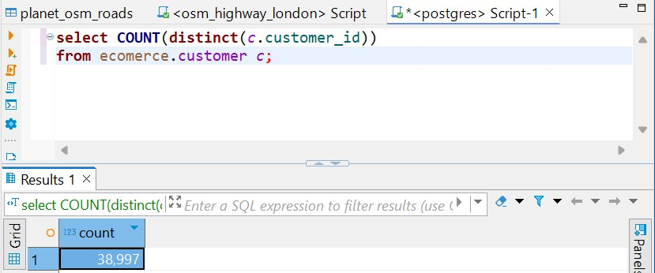
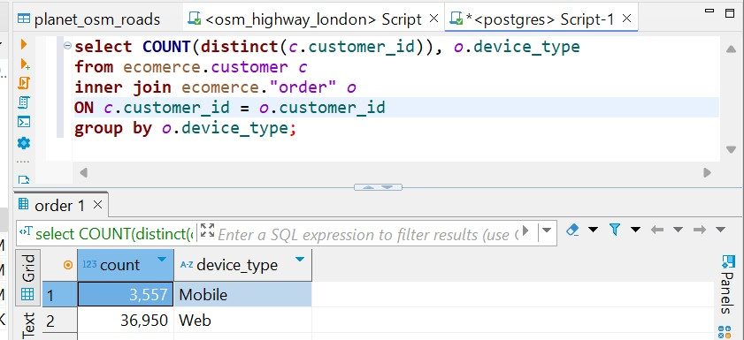
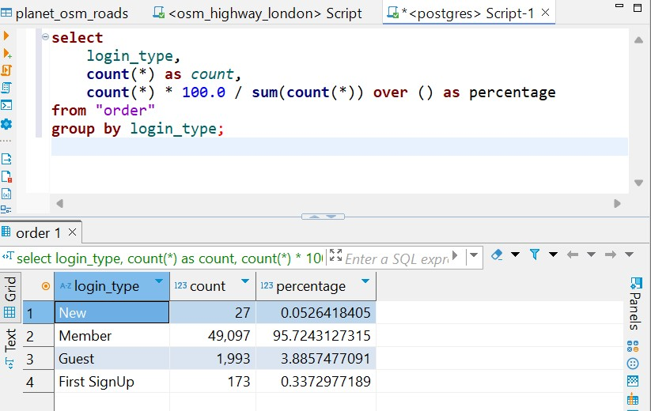
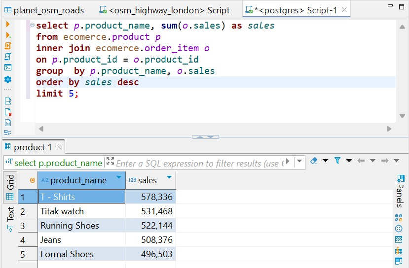
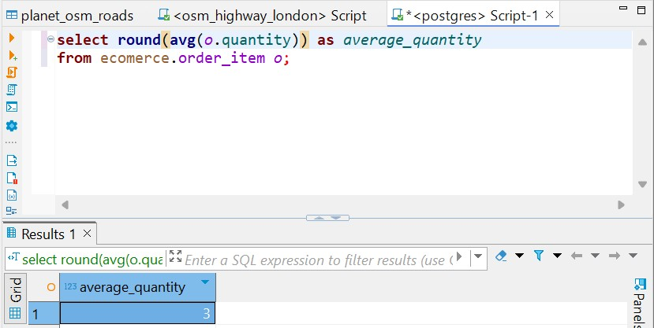
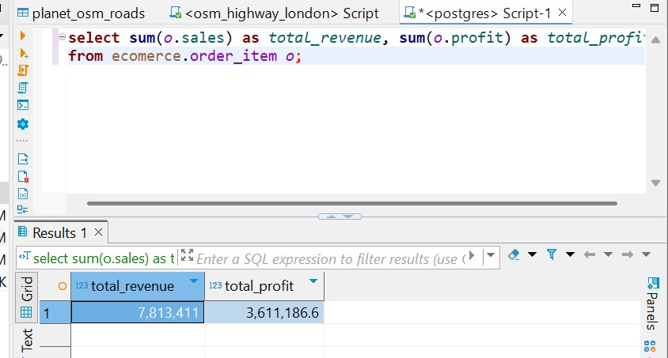
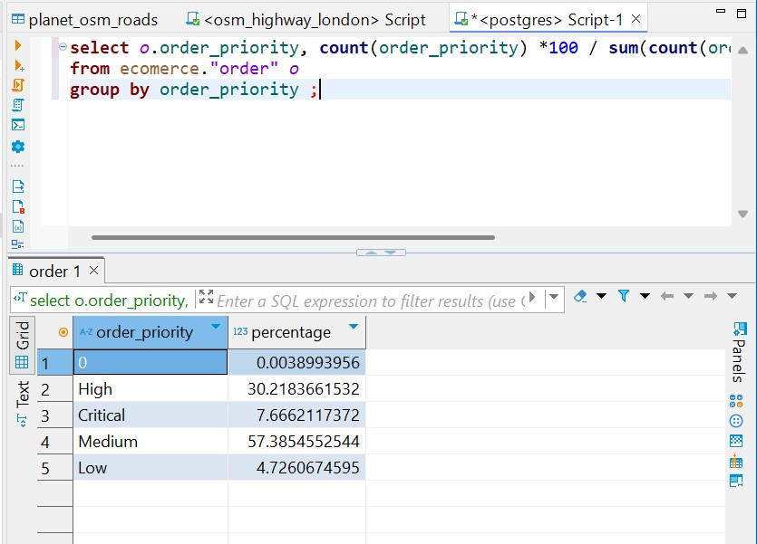
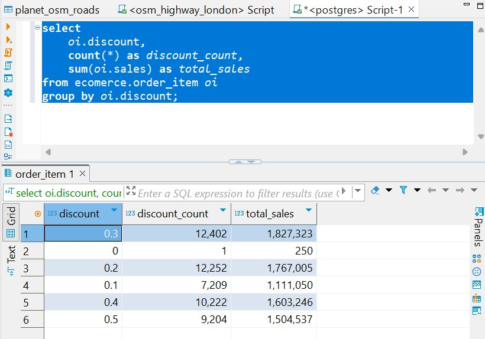

# **Project: E-commerce Backend System with PostgreSQL & FastAPI**
### Project OVerview
As a data engineer for an e-commerce website, you are given a CSV dataset containing raw transactional data. Your task is to design and implement a robust data pipeline that efficiently processes, stores, and exposes insights from this data. To achieve this, you first model the data into four key tables: Orders, Customers, Products, and Order Items. The Customers table holds user details, while the Products table contains product information. The Orders table tracks each transaction, linking customers to their purchases, and the Order Items table breaks down each order into individual product purchases, capturing quantities and prices. Once the schema is defined, you store the structured data in a PostgreSQL database, optimizing it with indexing and foreign key relationships for efficient queries. Next, you perform various computations, such as calculating total sales, customer lifetime value, and product performance metrics, directly in the database. To expose this data, you build a FastAPI endpoint that allows users to query and visualize key analytics, such as top-selling products, customer purchase behavior, and revenue trends. 

## **Prerequisites:**
Before starting this project, you should:
- Have basic knowledge of SQL (SELECT, INSERT, JOIN, INDEXING).
- Understand relational databases and how tables relate via foreign keys.
- Be familiar with Python, particularly working with Pandas, FASTAPI and SQLAlchemy.
- Have PostgreSQL installed and running on your system.

---
## **Goal:**
- Design a relational database based on the dataset.
- Load the provided CSV data into PostgreSQL.
- Write SQL queries for business insights.
- Expose API endpoints with FastAPI.
- Implement indexing and optimization.
- Use SQLAlchemy ORM for queries and operations.
- Document the API with Swagger UI (`/docs`)

---
## **Dataset Information**
https://github.com/Data-Epic/database-fundamentals/blob/main/data/ecommerce_dataset.csv.
This dataset simulates **real-world e-commerce transactions** with columns like:
- **Order details** (`Order_Date`, `Order_Priority`, `Payment_method`)
- **Customer information** (`Customer_id`, `Gender`, `Device_Type`, `Customer_Login_Type`)
- **Product information** (`Product_Category`, `Product`, `Quantity`, `Discount`, `Sales`)
- **Financial information** (`Profit`, `Shipping_cost`)


## **Project Structure**
```
ecommerce_api/
│── .gitignore
│── .env.example
│── README.md
│── pyproject.toml
│── poetry.lock
│── main.py
│
├── images/
│   ├── architecture.jpg
│   ├── data_model.jpg
│
├── notebooks/
│   ├── data_modeling.ipynb
│
├── logger/ 
│   ├── __init__.py
│   ├── logger.py
│
├── database/  
│   ├── __init__.py
│   ├── models.py 
│   ├── crud.py  
│   ├── db_setup.py 
│   ├── utils.py  
│
├── api/ 
│   ├── __init__.py
│   ├── routes.py 
│   ├── schema.py  
│   ├── crud.py  
│
├── data/  
│   ├── ecommerce_dataset.csv  
│
├── scripts/  
│   ├── load_data.py  
│   ├── utils.py  
│   ├── config.py 

```

### **Data Architecture**

---


### **Data Modelling**

---

## **Tasks**

### **🔹 Task 1: Define the PostgreSQL Database Schema**
- Create a database named **`ecommerce_db`**.
- Define tables in **SQLAlchemy ORM**:

### **🔹 Task 2: Load the CSV Data into PostgreSQL**
- Write a script (`scripts/load_data.py`) to **import `ecommerce_dataset.csv` into the four different PostgreSQL tables created above.**.
- Ensure proper **data type conversions** (dates, decimals, etc.).
- **Handle duplicates** using `ON CONFLICT` to avoid inserting the same customers multiple times.

---

### **🔹 Task 3: Write SQL Queries for Business Insights**
Write SQL queries to **analyze e-commerce performance**:

1️⃣ **Customer Insights**

   - Total number of **unique customers**.
   
    ```  
         select COUNT(distinct(c.customer_id))
         from ecomerce.customer c;
   ```
   

   - Number of **customers per device type (Web/Mobile)**.
   
   ```   
         select COUNT(distinct(c.customer_id)), o.device_type 
         from ecomerce.customer c
         inner join ecomerce."order" o 
         ON c.customer_id = o.customer_id 
         group by o.device_type;
   ```
   

   - Percentage of **members vs. guest users**.
   
   ```
      select  
      login_type,  
      count(*) as count,  
      count(*) * 100.0 / sum(count(*)) over () as percentage  
      from "order"  
      group by login_type;
   ```
   

2️⃣ **Product Performance**
   - Top **5 best-selling products** based on sales.
   
   ```  
         select p.product_name, sum(o.sales) as sales
         from ecomerce.product p 
         inner join ecomerce.order_item o
         on p.product_id = o.product_id
         group  by p.product_name, o.sales 
         order by sales desc
         limit 5;
   ```
   

   - Top **3 product categories** with the highest revenue.

   ```
      select p.product_category , sum(o.sales) as sales
      from ecomerce.product p 
      inner join ecomerce.order_item o
      on p.product_id = o.product_id
      group  by p.product_category
      order by sales desc
      limit 3;
   ```
   

   - Products with the **highest profit margins**.
   
   ```
      select p.product_name , sum(o.profit) as profit
      from ecomerce.product p 
      inner join ecomerce.order_item o
      on p.product_id = o.product_id
      group  by p.product_name
      order by profit desc
      limit 1;
   ```
   


3️⃣ **Order Analysis**
   - Average **order size (quantity per order)**.
   
   ```
      select round(avg(o.quantity)) as average_quantity
      from ecomerce.order_item o;
   ```
   

   - Total **revenue and profit**.
   
   ```
      select sum(o.sales) as total_revenue, sum(o.profit) as total_profit
      from ecomerce.order_item o;
   ```
   

   - Percentage of orders placed with **High or Critical priority**.
   ```
      select o.order_priority, count(order_priority) *100 / sum(count(order_priority)) over() as percentage
      from ecomerce."order" o
      group by order_priority ;
   ```
   

4️⃣ **Discount Impact**
   - Does **higher discount % lead to more sales**? 
   ```
      select  
      oi.discount,  
      count(*) as discount_count,  
      sum(oi.sales) as total_sales  
      from ecomerce.order_item oi  
      group by oi.discount;
   ```
   

---

### **🔹 Task 4: Expose API Endpoints with FastAPI**
Develop the following REST API endpoints:

| Endpoint | Method | Description |
|----------|--------|-------------|
| `/customers/` | **GET** | Get all customers |
| `/customers/{customer_id}` | **GET** | Get details of a specific customer |
| `/orders/` | **GET** | Get all orders |
| `/orders/{order_id}` | **GET** | Get details of a specific order |
| `/products/` | **GET** | Get all products |
| `/analytics/top-products/` | **GET** | Get top-selling products |
| `/analytics/revenue/` | **GET** | Get total revenue & profit |

- Use **SQLAlchemy ORM** to **interact with PostgreSQL**.
- Document all endpoints in **Swagger UI (`/docs`)**.

---

### **🔹 Task 5: Implement Indexing & Query Optimization**
1. **Create an index** on high-frequency search columns:
   ```sql
   CREATE INDEX idx_order_customer ON Orders(customer_id);
   CREATE INDEX idx_product_sales ON OrderItems(product_id);
   ```
2. **Explain how indexing improves query performance.**
3. **Use EXPLAIN ANALYZE** to compare indexed vs. non-indexed queries.


## Want to Explore my Project??

Follow these steps to set up and run the analysis

### 1. Clone the Repository
```bash
git clone https://github.com/Data-Epic/database-fundamentals.git
```

### 2. Create and Switch to a New Branch
```bash
git checkout -b adedoyin-samuel-project
```

### 3. Install Dependencies
```bash
poetry install
```

### 4. Activate the Virtual Environment
```bash
poetry shell
```

### 5. Run the Main Script
```bash
poetry run python main.py
```

### 6. Access API Documentation**  
Open your browser and go to:  
```
http://127.0.0.1:8000/docs
```  

