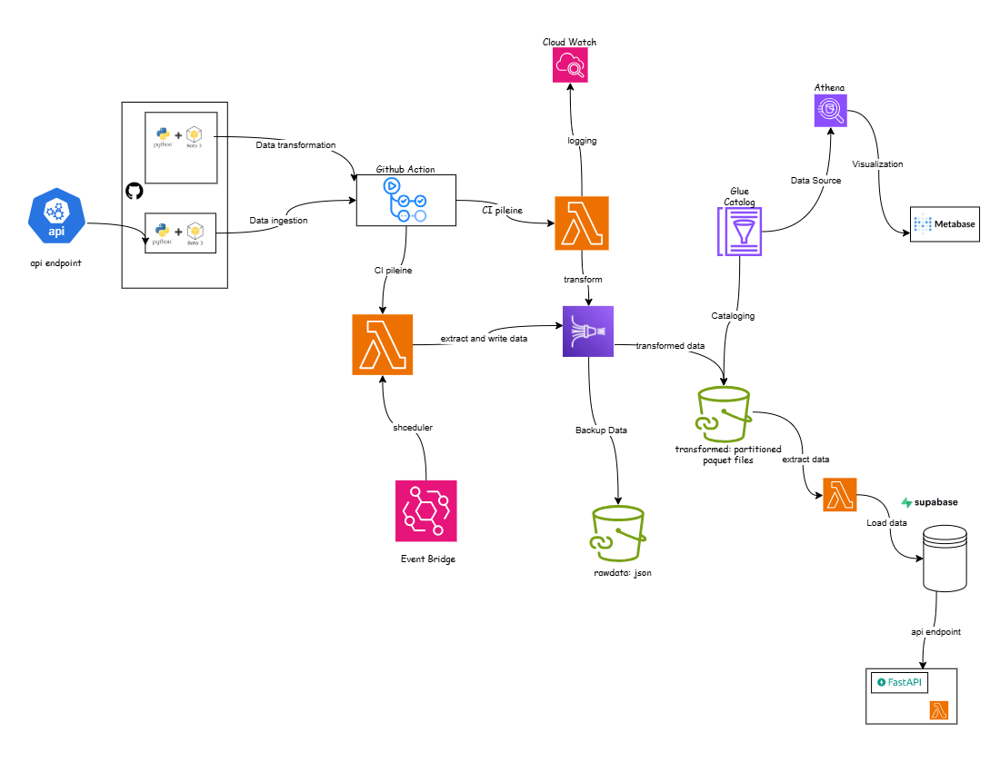

# Stock-Market-Data-Streaming-Analysis (Data Ingestion and Processing Pipeline)
This repository outlines a data engineering workflow that streams, transforms, stores, and visualizes data using AWS services and open-source tools.

## Project Overview
Stock prices for companies like TESLA (TSLA) and NVIDIA (NVDA) fluctuate rapidly. Your task is to build a real-time data pipeline that streams stock market data for these two companies using the Alpha Vantage API, processes the data to compute metrics like price changes, moving averages, and volume spikes, and stores the results in a queryable and structured format.

https://rapidapi.com/alphavantage/api/alpha-vantage https://www.alphavantage.co/documentation/

## Tasks 
1. **Select and justify a preferred tech stack.**
2. **Design and submit a high-level architecture diagram.**
3. **Break project into components and assign team members.**
4. **Share tools/resources to be used to execute the project.**
5. **Stores the results in an efficient format (partitioned by symbol/date/hour).**

## About the data
The data source provides updates at 1-minute and 5-minute intervals; we opted for the 1-minute frequency to ensure near real-time data freshness and more granular insights.

## Tools and Services Used
--**Rapid API**: https://www.alphavantage.co/documentation/
- **Python + Boto3**: For writing data ingestion scripts. (Producer)
- **GitHub Actions**: For CI/CD workflows.
- **AWS Lambda**: For serverless data transformation, Automating Producer,a dn moveing data to supabase.
- **Event Bridge**: Automating the data producer to send data every one seconds 
- **AWS Lambda**: For serverless data transformation, Automating Producer,a dn moveing data to supabase.
- **Amazon Kinesis Firehose**: For real-time data streaming and delivery.
- **Amazon S3**: For storing raw and transformed data.
- **AWS Glue Catalog**: For schema management and integration with Athena.
- **Amazon Athena**: For querying data directly from S3.
- **Metabase**: For data visualization.
- **Supabase**: For backend storage and integration.
- **FastAPI**: For serving processed data through APIs.
- **CloudWatch**: For monitoring logs and errors.

## Workflow Diagram  

## Step-by-Step Workflow Explanation

### Step 1: Data Ingestion
- Data is collected using Python scripts with the Boto3 SDK or from an exposed API endpoint, this is trigger uisng event bridge and lambda function
- GitHub Actions are configured for Continuous Integration (CI) to automate the deployment and execution of these data collection scripts.

### Step 2: Lambda Function for Data Transformation
- After the GitHub Action runs, it triggers an AWS Lambda function.
- This Lambda performs initial data transformation before forwarding the processed data.

### Step 3: Kinesis Firehose
- The transformed data is passed into Kinesis Firehose.
- Kinesis Firehose performs two actions:
  - Stores a copy of the **raw data** in JSON format in a designated S3 bucket.
  - Sends the transformed stream further down the pipeline for more processing.

### Step 4: Glue Catalog
- AWS Glue Catalog creates a metadata table for the incoming data.
- This catalog helps define the schema and partitioning of the data stored in S3.

### Step 5: Transformed Data Storage in S3
- Transformed and partitioned data is stored as **Parquet files** in a separate S3 bucket.
- This structure supports efficient querying and analytics.

### Step 6: Querying and Visualization with Athena and Metabase
- Amazon Athena queries the Parquet files using the schema provided by the Glue Catalog.
- The results can be visualized using Metabase for reporting and dashboard creation.

### Step 7: Further Processing with Lambda and FastAPI
- Another Lambda function reads from the transformed S3 bucket.
- It pushes the cleaned data to Supabase.
- A FastAPI service can be used to expose or consume this data via endpoints for use in applications.

### Step 8: Monitoring
- All Lambda functions are monitored via Amazon CloudWatch for logs and error tracking.

## Usage
1. Clone the repository.
2. Set up environment variables for AWS credentials and GitHub Actions.
3. Run GitHub workflows to trigger the pipeline.
4. Use Metabase or FastAPI to interact with the transformed data.

https://www.youtube.com/watch?v=xs9oJaaU8I8
# Stock-Market-Data-Streaming-Analysis

## Dataset Information 
|— metadata
|— timeseries (1-min)
   |—timestamp	(date and time data was pulled in one minute increments)
   |— symbol	 (TSLA or NVDA)
   |— open	(market price of stock when market opens)
   |— high	(highest price rise of stock in observed timeframe)
   |— low (lowest price fall of stock in observed timeframe)
   |— close	 (price of stock after observed timeframe)
   |— volume	 (volume of trade at the observed timeframe)

## Interested Metrics
»» price changes 
»» volume spikes
»» moving averages 

##📈 What Is a Price Change?
A price change simply measures how much the price of something (a TSLA or NVDA stock in our case) has gone up or down over a period of time.

##Two Main Types of Price Change
1. Absolute Price Change
This is just the difference in price between two points in time.

Formula:
Price Change = New Price - Old Price

2. Percentage Price Change
This refers to how big the change in price of a stock is in relation to the original price. It is very helpful when comparing different assets, say you want to compare how TSLA has risen or fallen against NVDA.

💡 Formula:
Price Change (%) = ((New - Old) / Old) × 100

##📊 What is a Volume Spike?
A volume spike happens when the trading volume at a given point in time is significantly higher than usual. It is usually observed by comparing current trade volume to previous trade volume.

For example, if the average volume for a stock is 1,000 over the last five minutes but in one minute that follows it has 5,000, that's a spike.

There were disparities in the metrics used per sources consulted but the basic idea behind defining a spike is:

A row where the current volume is X% higher than the average of the previous N rows (say, 3 or 5).

We went with:

Comparing the current row's volume to the average of the previous 3 rows

We encoded that a 'SPIKE' happens if current volume > 2 × average of last 3 volumes otherwise it is 'normal'

