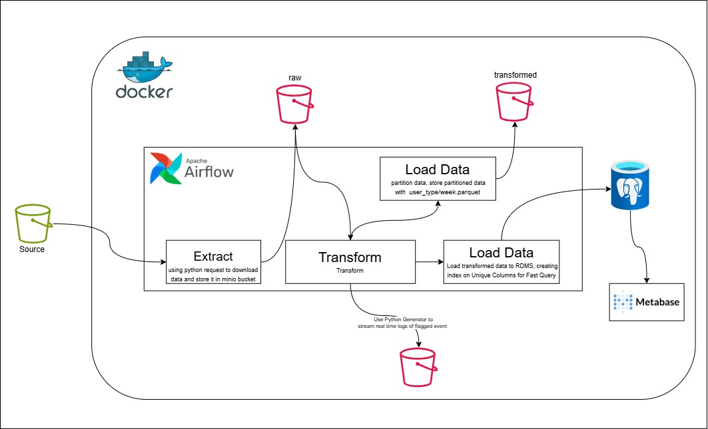
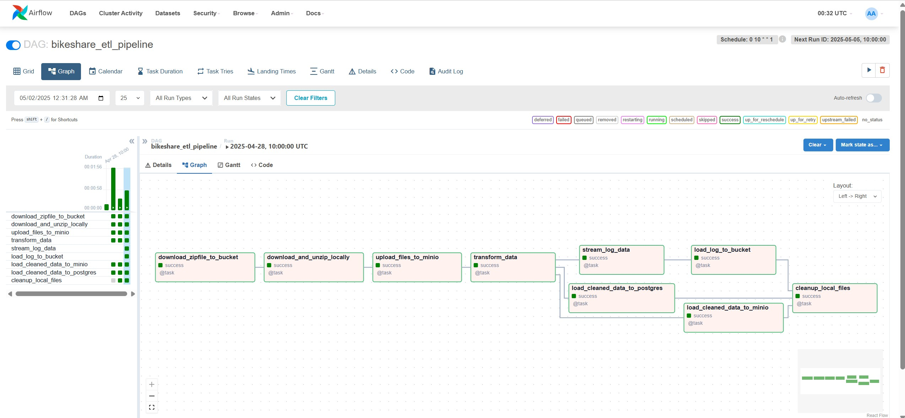
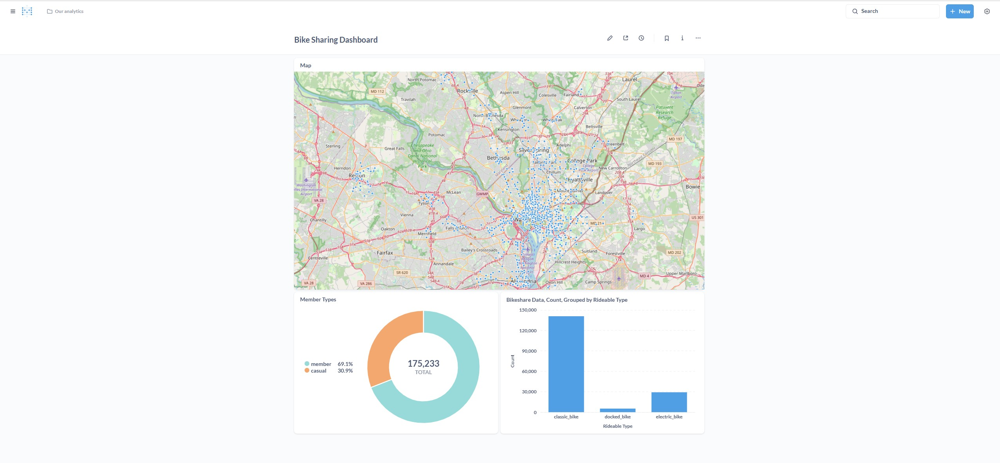

# Bikesharing ETL Pipeline

The Bikesharing ETL Pipeline project is a data engineering solution designed to automate the process of extracting, transforming, and loading (ETL) Capital Bikeshare trip data. The goal is to build a comprehensive data pipeline that handles large-scale data processing, enables real-time data analysis, and provides an interactive platform for data visualization.

This is a Dockerized, end-to-end data engineering project that ingests, processes, and visualizes Capital Bikeshare data. It features a scheduled ETL pipeline, real-time data flagging, partitioned storage in MinIO (S3), and interactive dashboards powered by Metabase.


## Project Goals

* Schedule weekly data ingestion and transformation jobs via Airflow
* Store cleaned datasets as partitioned Parquet files in MinIO
* Simulate real-time alerts for critical ride patterns
* Visualize insights with Metabase dashboards
* Deploy the entire stack using Docker Compose


## Tech Stack

| Component            | Tool/Technology                |
| -------------------- | ------------------------------ |
| Workflow Management  | Apache Airflow                 |
| Data Processing      | Pandas, Polars                 |
| Storage              | MinIO (S3-compatible), Parquet |
| Real-Time Simulation | Python generators              |
| Database             | PostgreSQL                     |
| Dashboarding         | Metabase                       |
| Containerization     | Docker, Docker Compose         |


## Project Structure

```
bikesharing_etl_adedoyin/
├── docker_mapped_output/           
│   └── data/
│       ├── airflow/                  
│       │   ├── dags/
│       │   │   └── etlpipeline.py    
│       │   └── utils/
│       │       ├── utils.py
│       │       └── logger.py
│       ├── postgres/              
│       ├── minio/                   
│       └── metbase/             
├── docker-compose.yml             
├── Dockerfile                    
├── .env                               
└── README.md                         

```

## Workflow


## Setup Instructions

### 1. Clone the Repository

```bash
git clone https://github.com/Data-Epic/bikesharing_etl_adedoyin.git
cd bikesharing_etl_adedoyin
```

### 2. Build and Launch Containers

```bash
docker build -t dev_apache_airflow:2.8.4 .
docker-compose up --build -d
```

### 3. Access the Interfaces

| Service    | URL                                            | Default Login                     |
| ---------- | ---------------------------------------------- | --------------------------------- |
| Airflow    | [http://localhost:8080](http://localhost:8080) | admin / admin                     |
| Metabase   | [http://localhost:3000](http://localhost:3000) | Set on first launch               |
| MinIO      | [http://localhost:9001](http://localhost:9001) | minioadmin / minioadmin           |
| PostgreSQL | Host: `localhost:5432`                         | User: airflow / Password: airflow |

## Data Upload (MinIO)

1. Open MinIO at `http://localhost:9001`
2. Create a buckets e.g, `bikeshare`

## Running the ETL Pipeline

1. Go to Airflow UI at `http://localhost:8080`
2. Trigger the DAG: `bikeshare_etl_pipeline`
3. Monitor each task and view logs


## Real-Time Flagging
* Simulates alerts for:
  * Rides over 45 minutes
  * Casual rides starting at midnight
* Implemented with a generator inside the DAG
* Alerts are printed in logs for tracking unusual patterns


## Data Visualization (Metabase)
* Connected to PostgreSQL for querying results
* Create visualizations

## Output Data
* Cleaned and transformed `.parquet` files
* Partitioned by:
  * `member_casual`
  * `week_number`
* Stored inside `docker_mapped_output/data/` and in MinIO

## Showcase

### Airflow Dags



### Metabase Dashbord



## Troubleshooting Resources
https://www.youtube.com/watch?v=tRlEctAwkk8 https://stackoverflow.com/questions/77355287/adding-local-minio-host-to-mc-configuration-failed-to-add-temporary-minio-ser
 https://stackoverflow.com/questions/60193781/postgres-with-docker-compose-gives-fatal-role-root-does-not-exist-error 
https://airflow.apache.org/docs/apache-airflow/stable/howto/docker-compose/index.html https://stackoverflow.com/questions/72222070/postgres-and-docker-compose-password-authentication-fails-and-role-postgres-d 
Setup_Airflow python depencies : https://www.youtube.com/watch?v=0UepvC9X4HY&t=300s, 
command=docker build . -t dev_apache_airflow:2.8.4 
https://www.youtube.com/watch?v=WglsTKda6Gc
s3 - coonection https://www.youtube.com/watch?v=sVNvAtIZWdQ
https://stackoverflow.com/questions/65272764/ports-are-not-available-listen-tcp-0-0-0-0-50070-bind-an-attempt-was-made-to
https://stackoverflow.com/questions/57741274/airflow-python-logging-module-doesnt-write-to-log-file